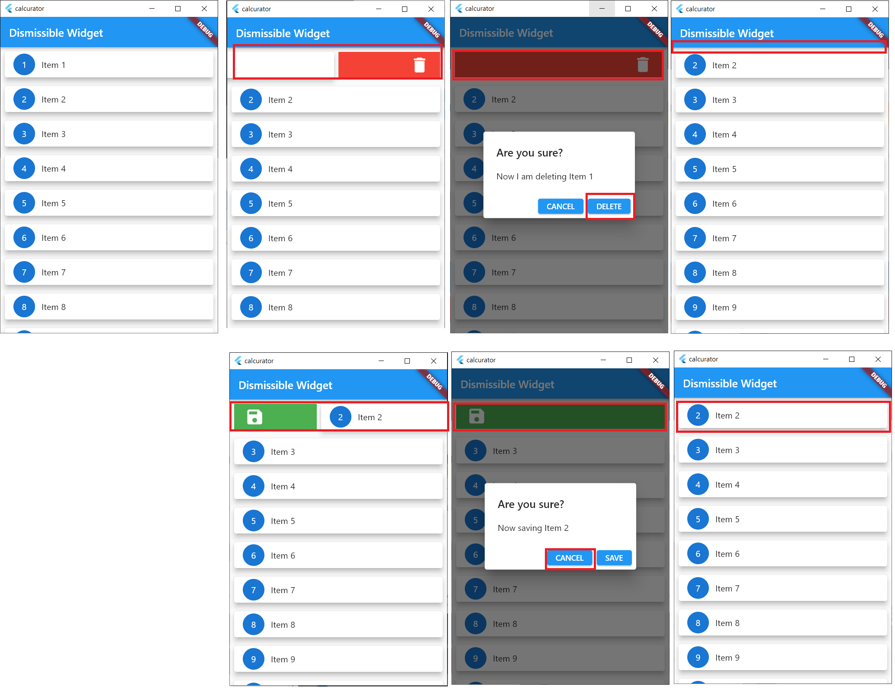

# dismissible 실행화면 

## 2. dismissible_110.dart 
1. 화면작동방법
 - List한건을 왼쪽으로 swipe하면 삭제여부 dialog창이 뜸   
    . 이때 DELETE를 누르면 List에서 삭제   
    . 이때 CANCEL를 누르면 LIST가 다시 보인다.
 - List한건을 오른쪽으로 swipe하면 저장여부 dialong창이 뜸
    . 이때 SAVE를 누르면 List에서 삭제   
    . 이때 CANCEL를 누르면 LIST가 다시 보인다.
2. 실행화면
 

